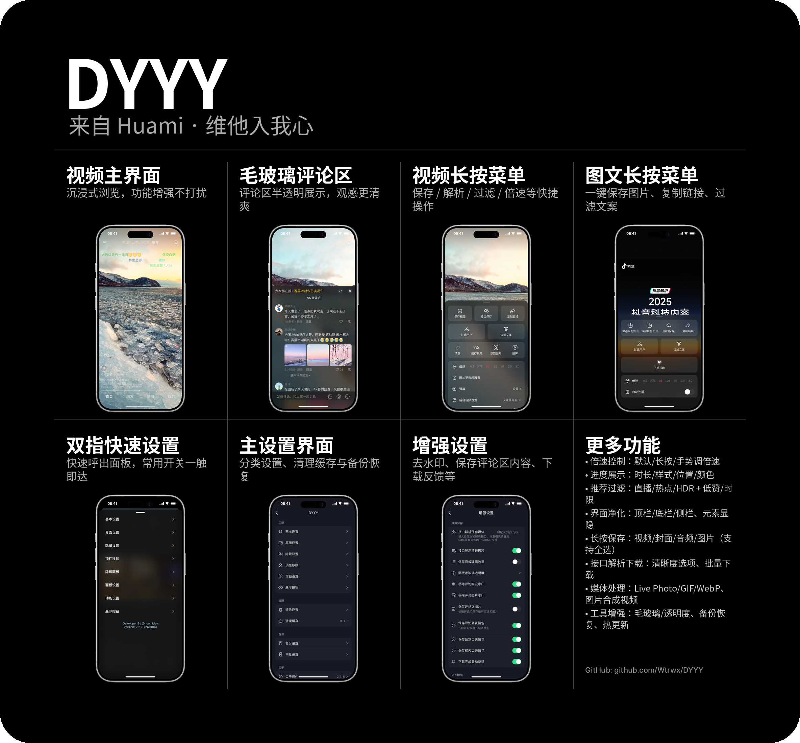

<p align="center">
  
</p>

<p align="center">
  
  
</p>

# DYYY

用于调整抖音 UI 的 Theos/Logos Tweak，仅在 **36.5.0 版本** 中测试。  
**仅供学习交流，禁止用于商业用途。**

## 目录
- [功能亮点](#功能亮点)
- [使用方式](#使用方式)
- [贡献者](#贡献者)
- [远程配置](#远程配置)
- [解析下载接口](#解析下载接口)
- [构建与打包](#构建与打包)
- [许可证](#许可证)

## 功能亮点
- 通过 **双指长按** 或 **抖音设置** 进入设置界面
- 支持远程 JSON 批量下发配置
- 解析多种下载接口字段（视频、图片、音频、封面）

## 使用方式
- 打开抖音后 **双指长按** 进入设置
- 或在 **抖音设置** 中找到 DYYY 入口

## 贡献者

<table>
  <tr>
    <td align="center"><a href="https://github.com/huami1314"></a><br /><sub><b>huami1314</b></sub></td>
    <td align="center"><a href="https://github.com/Wtrwx"></a><br /><sub><b>Wtrwx</b></sub></td>
    <td align="center"><a href="https://github.com/lihebgyee"></a><br /><sub><b>lihebgyee</b></sub></td>
    <td align="center"><a href="https://github.com/wahha2003"></a><br /><sub><b>wahha2003</b></sub></td>
    <td align="center"><a href="https://github.com/Nathalie-Annis"></a><br /><sub><b>Nathalie-Annis</b></sub></td>
  </tr>
  <tr>
    <td align="center"><a href="https://github.com/PaTTeeL"></a><br /><sub><b>PaTTeeL</b></sub></td>
    <td align="center"><a href="https://github.com/lihyee"></a><br /><sub><b>lihyee</b></sub></td>
    <td align="center"><a href="https://github.com/wwg135"></a><br /><sub><b>wwg135</b></sub></td>
    <td align="center"><a href="https://github.com/CW-1024"></a><br /><sub><b>CW-1024</b></sub></td>
    <td align="center"><a href="https://github.com/Wangin1996"></a><br /><sub><b>Wangin1996</b></sub></td>
  </tr>
  <tr>
    <td align="center"><a href="https://github.com/Patickhuang"></a><br /><sub><b>Patickhuang</b></sub></td>
    <td align="center"><a href="https://github.com/zhaoyuedong"></a><br /><sub><b>zhaoyuedong</b></sub></td>
    <td align="center"><a href="https://github.com/Huangbai233"></a><br /><sub><b>Huangbai233</b></sub></td>
    <td align="center"><a href="https://github.com/fries0710"></a><br /><sub><b>fries0710</b></sub></td>
    <td align="center"><a href="https://github.com/msm8976"></a><br /><sub><b>msm8976</b></sub></td>
  </tr>
  <tr>
    <td align="center"><a href="https://github.com/xiangfeidexiaohuo"></a><br /><sub><b>xiangfeidexiaohuo</b></sub></td>
    <td align="center"><a href="https://github.com/Mieing"></a><br /><sub><b>Mieing</b></sub></td>
    <td align="center"><a href="https://github.com/invalidunit"></a><br /><sub><b>invalidunit</b></sub></td>
    <td align="center"><a href="https://github.com/ways0210"></a><br /><sub><b>ways0210</b></sub></td>
    <td align="center"><a href="https://github.com/woqunimaxr"></a><br /><sub><b>woqunimaxr</b></sub></td>
  </tr>
  <tr>
    <td align="center"><a href="https://github.com/Sini921"></a><br /><sub><b>Sini921</b></sub></td>
    <td align="center"><a href="https://github.com/cbjn"></a><br /><sub><b>cbjn</b></sub></td>
    <td align="center"><a href="https://github.com/huami1214"></a><br /><sub><b>huami1214</b></sub></td>
    <td align="center"><a href="https://github.com/wangliang12138"></a><br /><sub><b>wangliang12138</b></sub></td>
    <td align="center"><a href="https://github.com/jiuwei95"></a><br /><sub><b>jiuwei95</b></sub></td>
  </tr>
  <tr>
    <td align="center"><a href="https://github.com/plplpmmmmh"></a><br /><sub><b>plplpmmmmh</b></sub></td>
  </tr>
</table>

## 远程配置

DYYY 可以通过远程 JSON 文件批量应用设置。默认下载地址在 `DYYYConstants.h` 中的 `DYYY_REMOTE_CONFIG_URL`。配置文件示例：

```json
{
    "mode": "DYYY_MODE_PATCH",
    "data": {
        "ExampleKey": true
    }
}
```

`mode` 字段可选，支持 `DYYY_MODE_PATCH` 和 `DYYY_MODE_REPLACE`，若省略则默认为补丁模式 (`DYYY_MODE_PATCH`)。

## 解析下载接口

### 示例1：多清晰度视频（含音频和封面）
```json
{
  "code": 200,
  "msg": "success",
  "data": {
    "video_list": [
      {"url": "https://video.com/hd.mp4", "level": "高清"},
      {"url": "https://video.com/sd.mp4", "level": "标清"}
    ],
    "cover": "https://image.com/cover.jpg",
    "music": "https://audio.com/bgm.mp3",
    "images": [
      "https://image.com/extra1.jpg",
      "https://image.com/extra2.jpg"
    ]
  }
}
```

### 示例2：单个视频资源（含封面）
```json
{
  "code": 200,
  "msg": "success",
  "data": {
    "video_url": "https://video.com/main.mp4",
    "cover": "https://image.com/thumbnail.jpg",
    "music_url": "https://audio.com/soundtrack.mp3"
  }
}
```

### 示例3：纯图片资源
```json
{
  "code": 200,
  "msg": "success",
  "data": {
    "images": [
      "https://image.com/photo1.jpg",
      "https://image.com/photo2.jpg"
    ],
    "pics": "https://image.com/cover.png",
    "img": [
      "https://image.com/additional.jpg"
    ]
  }
}
```

### 示例4：混合资源（视频+图片）
```json
{
  "code": 200,
  "msg": "success",
  "data": {
    "url": "https://video.com/short.mp4",
    "videos": [
      "https://video.com/extra.mp4"
    ],
    "cover": "https://image.com/poster.jpg",
    "images": [
      "https://image.com/screenshot1.png",
      "https://image.com/screenshot2.png"
    ]
  }
}
```

### 字段说明
| 字段名       | 类型       | 说明                               |
| ------------ | ---------- | ---------------------------------- |
| `video_list` | 对象数组   | 多清晰度选项，含`url`和`level`字段 |
| `videos`     | 字符串数组 | 多个视频资源的URL集合              |
| `video_url`  | 字符串     | 单个视频资源URL（优先使用字段）    |
| `video`      | 字符串     | 单个视频资源URL（备用字段）        |
| `url`        | 字符串     | 通用资源URL（视频优先）            |
| `cover`      | 字符串     | 封面图URL（主字段）                |
| `pics`       | 字符串     | 封面图URL（备用字段）              |
| `music`      | 字符串     | 背景音乐URL（主字段）              |
| `music_url`  | 字符串     | 背景音乐URL（备用字段）            |
| `images`     | 字符串数组 | 附加图片资源集合                   |
| `img`        | 字符串数组 | 附加图片资源集合（备用字段）       |

## 构建与打包

- 本地验证：

```bash
make clean package
```

- 安装到设备（需要配置 `THEOS_DEVICE_IP`）：

```bash
make package INSTALL=1
```

- 切换不同包方案（示例 rootless）：

```bash
make package SCHEME=rootless
```

- CI/无人值守：

```bash
GITHUB_ACTIONS=true make package
```

## 许可证

详见 `LICENSE`。
